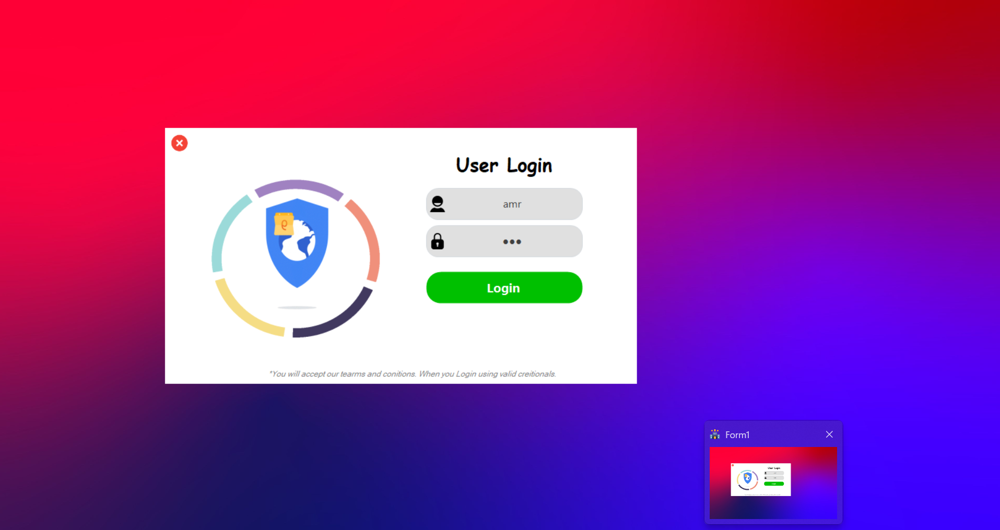
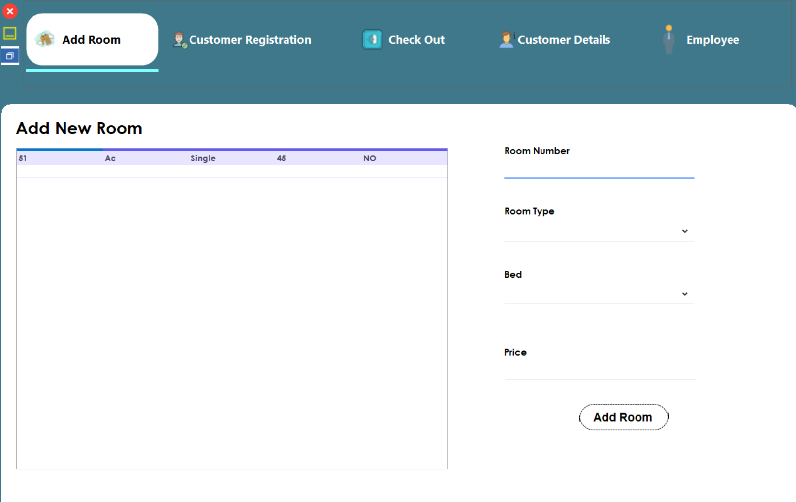
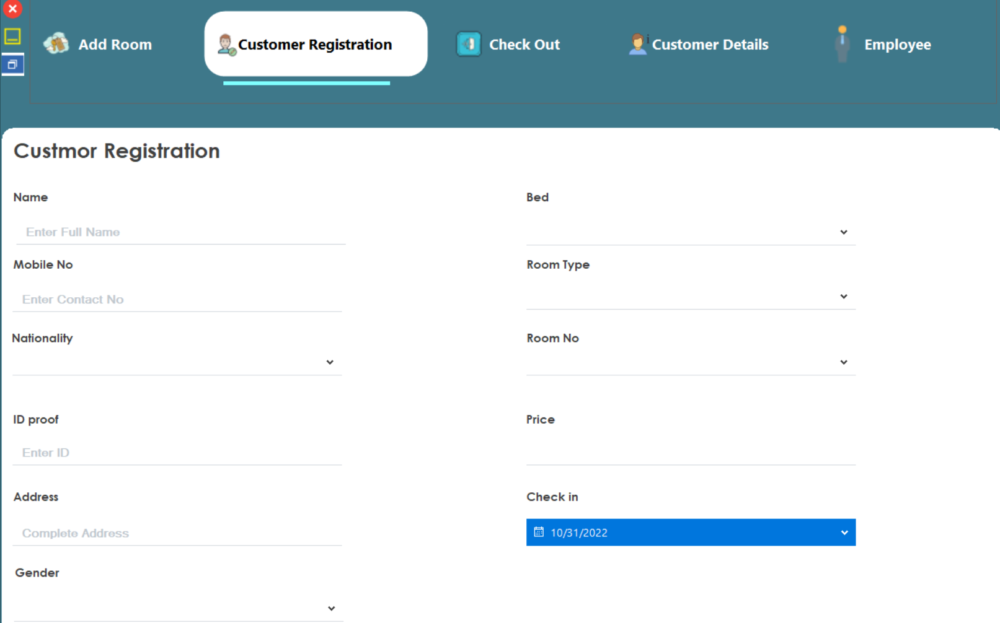
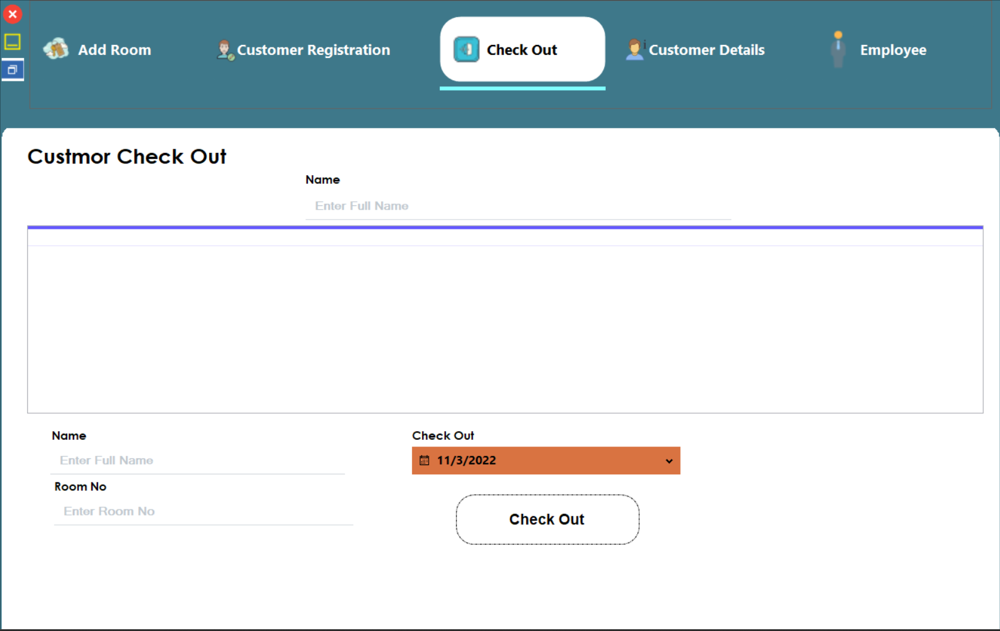
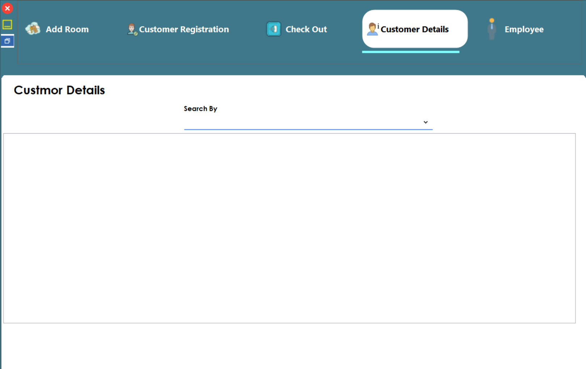
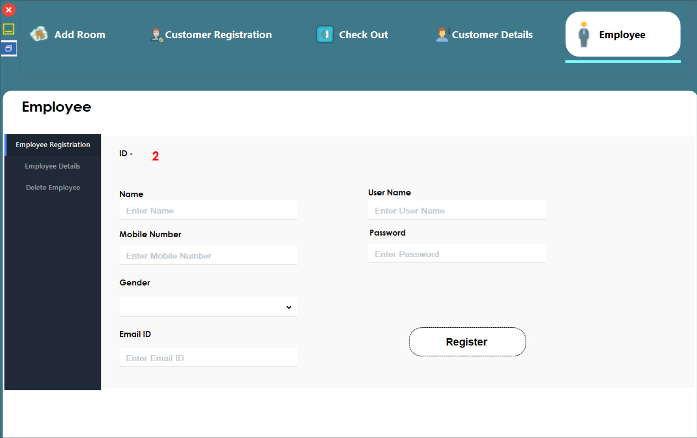

# 🏨 Hotel Management System (Mini Project)

## 📌 Project Overview

This is my **first database-connected project** – a **Hotel Management System** developed as part of my university **Database course** assignment.

The project was completed on **November 4, 2022**, and represents my initial hands-on experience with integrating a **C# Windows Forms application** with a **Microsoft SQL Server database**.

It is a **Mini Project** that demonstrates basic CRUD operations, user authentication, and a role-based dashboard for managing hotel operations such as room allocation, customer check-in/out, and employee management.

---

## 👨‍💻 Author

- **Name:** Amr Sallam
- **Course:** Database Course
- **Date:** 04/11/2022
- **University Project:** MTI

---

## 🛠️ Technologies Used

| Technology | Purpose |
|------------|---------|
| **C# (.NET Framework)** | Core programming language |
| **Windows Forms (WinForms)** | GUI development |
| **SQL Server (Local DB)** | Database backend |
| **ADO.NET (SqlConnection, SqlDataAdapter)** | Database connectivity |
| **Guna.UI2 WinForms** | Modern UI components |

---

## ✨ Features

### 🔐 Login System
- Secure employee login using username and password
- Error handling for invalid credentials

### 🏠 Room Management
- Add new rooms (Room Number, Type – AC/Non-AC, Bed Type, Price)
- View all rooms in a DataGridView
- Automatically refresh room list after adding

### 👤 Customer Registration (Check-In)
- Register new customers with personal details (Name, Mobile, Nationality, Gender, DOB, ID Proof, Address)
- Select room dynamically based on Bed Type and Room Type
- Automatically fetch room price and update room status to `booked = 'Yes'`

### 📋 Customer Details
- View all customers
- Filter by:
  - All customers
  - Currently checked-in customers
  - Checked-out customers

### 🚪 Customer Check-Out
- Search customers by name
- Update checkout date and mark room as available (`booked = 'NO'`)
- Update customer record with `chekout = 'Yes'`

### 👥 Employee Management
- Register new employees (Name, Mobile, Email, Gender, Username, Password)
- View all employees in a table
- Delete employee records

### 🧭 Dashboard Navigation
- Side menu with animated sliding panel
- Switch between modules:
  - Add Room
  - Customer Registration
  - Check Out
  - Customer Details
  - Employee

### 🪟 Window Controls
- Custom minimize, maximize/restore, and exit buttons
- Borderless form design with rounded corners

---

## 🗄️ Database Schema (SQL Server)

The database is named **`myHotel`** and includes the following tables (based on code analysis):

### `rooms`
| Column     | Type      | Description |
|------------|-----------|-------------|
| roomid     | INT (PK)  | Auto-increment |
| roomNo     | VARCHAR   | Room number |
| roomType   | VARCHAR   | AC / Non-AC |
| bed        | VARCHAR   | Single, Double, Triple, Couple |
| price      | INT       | Room price per night |
| booked     | VARCHAR   | YES / NO |

### `customer`
| Column      | Type      | Description |
|-------------|-----------|-------------|
| cid         | INT (PK)  | Auto-increment |
| cname       | VARCHAR   | Customer name |
| mobile      | VARCHAR   | Contact number |
| nationality | VARCHAR   | Country |
| gender      | VARCHAR   | Male / Female / Other |
| dob         | DATE      | Date of birth |
| idproof     | VARCHAR   | ID proof number |
| addres      | VARCHAR   | Address |
| checkin     | DATE      | Check-in date |
| checkout    | DATE      | Check-out date |
| chekout     | VARCHAR   | YES / NO (checkout status) |
| roomid      | INT (FK)  | References `rooms(roomid)` |

### `employee`
| Column   | Type      | Description |
|----------|-----------|-------------|
| eid      | INT (PK)  | Auto-increment |
| ename    | VARCHAR   | Employee name |
| mobile   | VARCHAR   | Contact |
| gender   | VARCHAR   | Gender |
| emailid  | VARCHAR   | Email |
| username | VARCHAR   | Login username |
| pass     | VARCHAR   | Login password |

> **Views used in the project (based on code):**
> - `ViewRoom`
> - `CustomerView`
> - `CustomerDetails`
> - `CustomerInHotel`
> - `CustomerCheckOut`
> - `EmployeeView`

---

## 📸 Screenshots

Here are some screenshots of the application in action:
## 📸 Screenshots

| | |
|:---:|:---:|
|  |  |
|  |  |
|  |  |

---

## 🚀 How to Run the Project

### Prerequisites
- Visual Studio (2017 or later)
- SQL Server (LocalDB or full instance)
- .NET Framework (version used in project)
